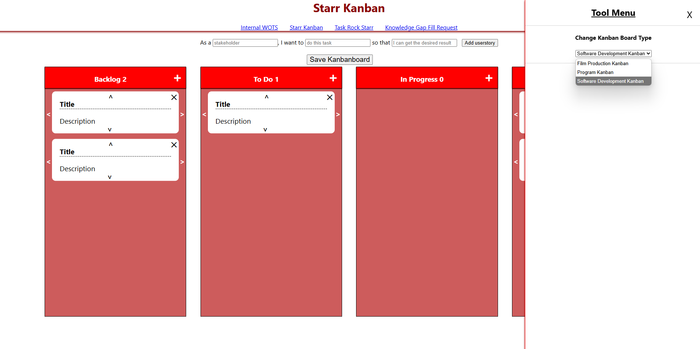

# ✨ Starr Kanban

> Internal productivity suite for Starr Street Media — built to flex with the creative and technical demands of a growing team.

**Starr Kanban** was an in-house tool developed to manage our workflows, track team tasks, and close skill gaps through structured learning requests. Whether we were producing films, building software, or launching internal initiatives, Starr Kanban kept us aligned.

## 🖼 Screenshot

---

## 🧰 What It Included

### ✅ **Task Tracker**

A shared task list for capturing general to-dos and tracking progress across the team. Fast, simple, and always visible.

---

### 🧠 **Knowledge Gap Fill Requests**

A dedicated form where team members could request:
- Tutorials or documentation
- Live help or demos
- Resources to upskill in areas like design, dev, marketing, and more

This kept our learning velocity high. No guessing, no bottlenecks.

---

### 🗂️ **Multi-Mode Kanban Board**

The heart of the tool. A flexible Kanban system with multiple configurations tailored to our core workflows:

- **Software Development Mode**  
- **Film Production Mode**  
- **Program Mode**  

#### 🧾 Input Options
- **Free-Form Cards:**  
  Click "+" to create a new card with title and description  
- **User Story Format:**  
  Structured entry via:  
  `As a [user], I want to [action], so that [goal]`

---

## 🛠 Tech Stack

- **HTML + CSS** – Core structure and styling of the interface  
- **JavaScript (ES6+)** – UI logic, dynamic rendering, and state handling  
- **LocalStorage** – Persistent client-side data storage for task and board state  
- **Vanilla DOM API** – No frameworks, just clean, native DOM manipulation

> (Tool was used internally and not connected to any cloud database or external APIs)

---

## 🎬 Why It Was Built

We needed a tool that:
- Matched the *diverse workflows* of a startup doing both media and software  
- Encouraged continuous learning through *structured requests*  
- Could *evolve fast* without dependency on external platforms

Starr Kanban did exactly that, quietly keeping things moving behind the scenes.

---

## 🪦 Status

**Sunsetted.**  
This tool was developed specifically for **Starr Street Media** and has since been archived. No public demo is currently available, but the codebase is preserved for reference or potential revival.

---

## 📬 Contact

Made by **[Derrick Gallegos](https://www.linkedin.com/in/derrickgallegos/)**
